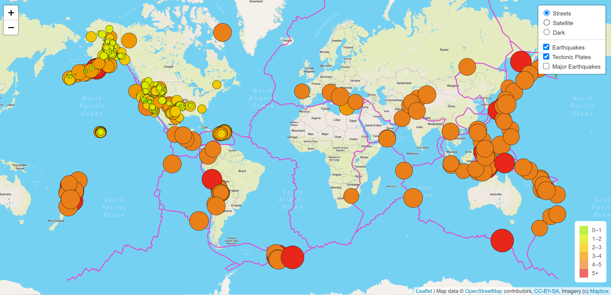

# Mapping_Earthquakes

## Purpose/Overview

This project was meant to provide a visual representation of earthquake location and magnitude. The webpage shows all earthquakes and their corresponding magnitudes within the last 7 days. It also show the major fault lines around the world.  

## Process

The following describes the process that was taken to create the map being displayed:
- Maps layers were pulled from Leaflet JavaScript library
- Earthquake data was then pulled from earthquake.usgs.gov - The data used was from the previous 7 days.  This can be changed be changing the link in the logic.js code.
- The earthquake data was mapped onto the original map using circle markers
- The marker's color and size were changed to match the magnitude of the earthquake
- A legend was created to describe magnitude of each color
- Different base map layers were added to allow user to switch between desired modes (Streets, Satellite, and Dark)
- Different overlay layers were added to allow user to select desired information
  - A layer to show all earthquakes within the last 7 days
  - A layer to show the major fault lines of the world - This data was taken from another github account:
    - "https://raw.githubusercontent.com/fraxen/tectonicplates/master/GeoJSON/PB2002_boundaries.json"
  - A layer to show only those earthquakes with a magnitude of 4.5 or higher ("Major Earthquakes")

The following is an image of the final product.

## Discussion
- The map shows that the majority of earthquakes take place on the major fault lines of the world.  There do seem to be smaller earthquakes happening outside of these fault lines (especially in the United States).  The map will change from day to day as the newest earthquakes are entered and the earthquakes more than 7 days old phase out. 
